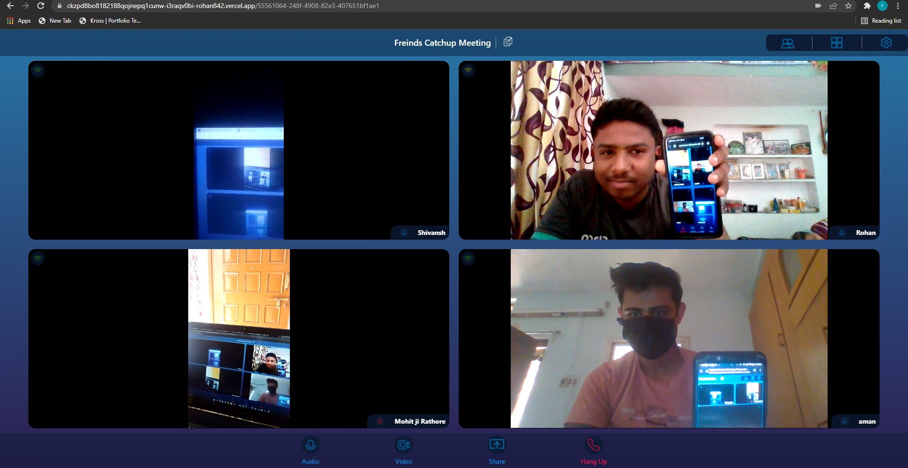

# [Group-Video-Chat-Web-App](https://ckzpd8bo8182188qojnepq1cunw-i3raqv0bi-rohan842.vercel.app/create) ⭐

&nbsp;
&nbsp;
&nbsp;<br/>
&nbsp;<br/>
&nbsp;
&nbsp;


[](https://ckzpd8bo8182188qojnepq1cunw-i3raqv0bi-rohan842.vercel.app/create)
[](https://github.com/ROHAN842/Group-Video-Chat-Web-App)

## Overview 👀


- Real time video chat 📹 with multiple user 
- Clean UI ⚡

## What is Group Video Chatting Web App? 🤔

#### This is basically a group video chatting web app in which multiple users can join in at a single time. It's front end is purely made with HTML5, CSS3, Bootstrap4 and Javascript, while the back end is completely framed by using socket.io with node.js and express.js as server. 


## How it works? 🤔
- **Open the website [https://ckzpd8bo8182188qojnepq1cunw-i3raqv0bi-rohan842.vercel.app/create](https://ckzpd8bo8182188qojnepq1cunw-i3raqv0bi-rohan842.vercel.app/create)**
- **User can just start the meeting as host and also they can name the meeting.**
- **After that 2 URL will be displayed one Attendee URL and another Host URL.**
- **If user wants himself as host then he can start meeting as host and share the attendee URL to another group of people.**
- **But if user doesn't want to become host then user can just share host URL to some another person who wants to be host and the user can join the meeting with the attendee URL.**
- **All URL's are easily copied to clipboard.**
- **Every user in meeting can control their audio and Video controls.**
- **Screen sharing feature is also available for every user.**
- **Host has the power to mute user's audio, video and also can remove them from meeting.**


## Dependencies 🗃

- [Bootstrap4](https://getbootstrap.com/docs/4.0/getting-started/introduction/) - **Frontend CSS Framework**
- [Node.js](https://nodejs.org/en/) - **Backend Framework**
- [Express.js](https://expressjs.com/) - **Server Side Node.js Framework**
- [Socket.io](https://socket.io/) - **Client-Server Communication**

## Run Locally 💻

```
> Clone the repo
    >> For Windows: Git Bash
    >> For Linux: Terminal
    >> git clone https://github.com/ROHAN842/Video-Chat-Web-app.git
    >> cd MainFolder/DirectoryName
> Install all dependencies
    >> npm i
> Split the terminal window into two parts 
> Spin the server on port 5000
    >> cd MainFolder/Directory
    >> nodemon or node index.js
> Visit the website on http://localhost:3000/
    
```
